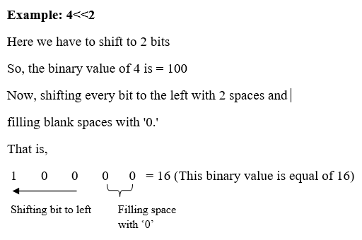
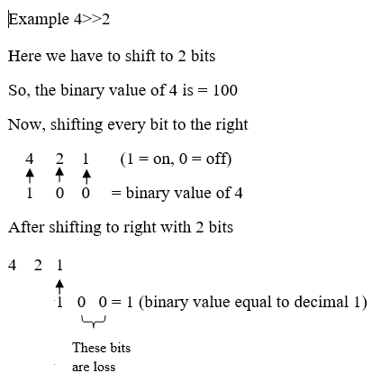

OPERATORS

Python has seven types of operators that we can use to perform different operation and produce a result.

1. Arithmetic operator
2. Relational operators
3. Assignment operators
4. Logical operators
5. Membership operators
6. Identity operators
7. Bitwise operators

* [Arithmetic operator](https://pynative.com/python-operators/#h-arithmetic-operator)
  * [Addition operator +](https://pynative.com/python-operators/#h-addition-operator)
  * [Subtraction –](https://pynative.com/python-operators/#h-subtraction)
  * [Multiplication *](https://pynative.com/python-operators/#h-multiplication)
  * [Division /](https://pynative.com/python-operators/#h-division)
  * [Floor division //](https://pynative.com/python-operators/#h-floor-division)
  * [Modulus ℅](https://pynative.com/python-operators/#h-modulus)
  * [Exponent **](https://pynative.com/python-operators/#h-exponent)
* [Relational (comparison) operators](https://pynative.com/python-operators/#h-relational-comparison-operators)
* [Assignment operators](https://pynative.com/python-operators/#h-assignment-operators)
* [Logical operators](https://pynative.com/python-operators/#h-logical-operators)
  * [and (Logical and)](https://pynative.com/python-operators/#h-and-logical-and)
  * [or (Logical or)](https://pynative.com/python-operators/#h-or-logical-or)
  * [not (Logical not)](https://pynative.com/python-operators/#h-not-logical-not)
* [Membership operators](https://pynative.com/python-operators/#h-membership-operators)
  * [In operator](https://pynative.com/python-operators/#h-in-operator)
  * [Not in operator](https://pynative.com/python-operators/#h-not-in-operator)
* [Identity operators](https://pynative.com/python-operators/#h-identity-operators)
  * [is operator](https://pynative.com/python-operators/#h-is-operator)
  * [is not operator](https://pynative.com/python-operators/#h-is-not-operator)
* [Bitwise Operators](https://pynative.com/python-operators/#h-bitwise-operators)
  * [Bitwise and &amp;](https://pynative.com/python-operators/#h-bitwise-and)
  * [Bitwise or |](https://pynative.com/python-operators/#h-bitwise-or)
  * [Bitwise left-shift &lt;&lt;](https://pynative.com/python-operators/#h-bitwise-left-shift)
  * [Bitwise right-shift &gt;&gt;](https://pynative.com/python-operators/#h-bitwise-right-shift)

## Arithmetic operator

Arithmetic operators are the most commonly used. The Python programming language provides arithmetic operators that perform addition, subtraction, multiplication, and division. It works the same as basic mathematics.

There are seven arithmetic operators we can use to perform different mathematical operations, such as:

1. `+` (Addition)
2. `-` (Subtraction)
3. `*` (Multiplication)
4. `/` (Division)
5. `//` Floor division)
6. `℅` (Modulus)
7. `**` (Exponentiation)

Now, let’s see how to use each arithmetic operator in our program with the help of examples.

### Addition operator `+`

It adds two or more operands and gives their sum as a result. It works the same as a unary plus. In simple terms,  It performs the addition of two or more than two values and gives their sum as a result.

x = 10
y = 40
print(x + y)

# Output 50

name = "Kelly"
surname = "Ault"
print(surname + " " + name)

# Output Ault Kelly

x = 10
y = 40
print(y - x)

# Output 30

x = 2
y = 4
z = 5
print(x * y)

# Output 8 (2*4)

print(x * y * z)

# Output 40 (2*4*5)

name = "Jessa"
print(name * 3)

# Output JessaJessaJessa

x = 2
y = 4
z = 8
print(y / x)

# Output 2.0

print(z / y / x)

# Output 1.0

# print(z / 0)  # error

x = 2
y = 4
z = 2.2

# normal division

print(y / x)

# Output 2.0

# floor division to get result as integer

print(y // x)

# Output 2

# normal division

print(y / z)  # 1.81

# floor division.

# Result as float because one argument is float

print(y // z)  # 1.0

x = 15
y = 4

print(x % y)

# Output 3

num = 2

# 2*2

print(num ** 2)

# Output 4

# 2*2*2

print(num ** 3)

# Output 8

## Relational (comparison) operators

Relational operators are also called comparison operators. It performs a comparison between two values. It returns a boolean  True or False depending upon the result of the comparison.

Python has the following six relational operators.

Assume variable `x` holds 10 and variable `y` holds 5

| **Operator**               | **Description**                                                     | Example                          |
| -------------------------------- | ------------------------------------------------------------------------- | -------------------------------- |
| `>`(Greater than)              | It returns True if the left operand is greater than the right             | `x > y` ``result is `True`   |
| `<`(Less than)                 | It returns True if the left operand is less than the right                | `x < y` ``result is `False`  |
| `==`(Equal to)                 | It returns True if both operands are equal                                | `x == y` ``result is `False` |
| `!=`(Not equal to)             | It returns True if both operands are equal                                | `x != y` ``result is `True`  |
| `>=`(Greater than or equal to) | It returns True if the left operand is greater than or equal to the right | `x >= y` ``result is `True`  |
| `<=`(Less than or equal to)    | It returns True if the left operand is less than or equal to the right    | `x <= y` ``result is `False` |

x = 10
y = 5
z = 2

# > Greater than

print(x > y)  # True
print(x > y > z)  # True

# < Less than

print(x < y)  # False
print(y < x)  # True

# Equal to

print(x == y)  # False
print(x == 10)  # True

# != Not Equal to

print(x != y)  # True
print(10 != x)  # False

# >= Greater than equal to

print(x >= y)  # True
print(10 >= x)  # True

# <= Less than equal to

print(x <= y)  # False
print(10 <= x)  # True

## Assignment operators

In Python, Assignment operators are used to assigning value to the variable. Assign operator is denoted by = symbol. For example, `name = "Jessa"` here, we have assigned the string literal ‘Jessa’ to a variable name.

Also, there are shorthand assignment operators in Python. For example, `a+=2` which is equivalent to `a = a+2`.

| **Operator**                 | **Meaning**                                                             | **Equivalent** |
| ---------------------------------- | ----------------------------------------------------------------------------- | -------------------- |
| `=`(Assign)                      | `a=5`Assign 5 to variable `a`                                             | a = 5                |
| `+=`(Add and assign)             | `a+=5`Add 5 to a and assign it as a new value to `a`                      | a = a+5              |
| `-=`(Subtract and assign)        | `a-=5`Subtract 5 from variable `a`and assign it as a new value to `a`   | a = a-5              |
| `*=`(Multiply and assign)        | `a*=5`Multiply variable `a`by 5 and assign it as a new value to `a`     | a = a*5              |
| `/=`(Divide and assign)          | `a/=5`Divide variable `a`by 5 and assign a new value to `a`             | a = a/5              |
| `%=`(Modulus and assign)         | `a%=5`Performs modulus on two values and assigns it as a new value to `a` | a = a%5              |
| `**=`(Exponentiation and assign) | `a**=5`Multiply `a`five times and assigns the result to `a`             | a = a**5             |
| `//=`(Floor-divide and assign)   | `a//=5`Floor-divide `a`by 5 and assigns the result to `a`               | a = a//5             |

a = 4
b = 2

a += b
print(a)  # 6

a = 4
a -= 2
print(a)  # 2

a = 4
a *= 2
print(a)  # 8

a = 4
a /= 2
print(a)  # 2.0

a = 4
a **= 2
print(a)  # 16

a = 5
a %= 2
print(a)  # 1

a = 4
a //= 2
print(a)  # 2

## Logical operators

Logical operators are useful when checking a condition is `true` or not. Python has three logical operators. All logical operator returns a boolean value `True` or `False `depending on the condition in which it is used.

| **Operator**   | **Description**                  | **Example** |
| -------------------- | -------------------------------------- | ----------------- |
| `and`(Logical and) | True if both the operands are True     | a and b           |
| `or`(Logical or)   | True if either of the operands is True | a or b            |
| `not`(Logical not) | True if the operand is False           | not a             |

### and (Logical and)

The logical `and` operator returns `True `if both expressions are True. Otherwise, it will return. `False`.

**Example**

print(True and False)  # False

# both are True

print(True and True)  # True
print(False and False)  # False
print(False and True)  # false

# actual use in code

a = 2
b = 4

# Logical and

if a > 0 and b > 0:
    # both conditions are true
    print(a * b)
else:
    print("Do nothing")

### or (Logical or)

The **logical** `or` the operator returns a boolean  `True` if one expression is true, and it returns `False` if both values are `false`.

**Example**

print(True or False)  # True
print(True or True)  # True
print(False or False)  # false
print(False or True)  # True

# actual use in code

a = 2
b = 4

# Logical and

if a > 0 or b < 0:
    # at least one expression is true so conditions is true
    print(a + b)  # 6
else:
    print("Do nothing")

### not (Logical not)

The **logical** `not` operator returns boolean `True` if the expression is `false`.

print(not False)  # True return complements result
print(not True)  # True return complements result

# actual use in code

a = True

# Logical not

if not a:
    # a is True so expression is False
    print(a)
else:
    print("Do nothing")

## Membership operators

Python’s membership operators are used to check for membership of objects in sequence, such as string, `list`, `tuple`. It checks whether the given value or variable is present in a given sequence. If present, it will return `True` else `False`.

In Python, there are two membership operator `in` and `not in`

### In operator

It returns a result as `True` if it finds a given object in the sequence. Otherwise, it returns `False`.

my_list = [11, 15, 21, 29, 50, 70]
number = 15
if number in my_list:
    print("number is present")
else:
    print("number is not present")

### Not in operator

It returns `True` if the object is not present in a given sequence. Otherwise, it returns `False`

my_tuple = (11, 15, 21, 29, 50, 70)
number = 35
if number not in my_tuple:
    print("number is not present")
else:
    print("number is present")

## Identity operators

Use the Identity operator to check whether the value of two variables is the same or not. This operator is known as a **reference-quality operator** because the identity operator compares values according to two variables’ memory addresses.

Python has 2 identity operators `is` and `is not`.

### `is` operator

The `is` operator returns Boolean `True` or `False`. It Return `True` if the memory address first value is equal to the second value. Otherwise, it returns `False`.

**Example**

x = 10
y = 11
z = 10
print(x is y) # it compare memory address of x and y
print(x is z) # it compare memory address of x and z

### `is not` operator

The `is not` the operator returns boolean values either `True` or `False`. It Return `True` if the first value is not equal to the second value. Otherwise, it returns `False`.

**Example**

x = 10
y = 11
z = 10
print(x is not y) # it campare memory address of x and y
print(x is not z) # it campare memory address of x and z

## Bitwise Operators

In Python, bitwise operators are used to performing bitwise operations on integers. To perform bitwise, we first need to convert integer value to binary (0 and 1) value.

The bitwise operator operates on values bit by bit, so it’s called  **bitwise** . It always returns the result in decimal format. Python has  bitwise operators listed below.

1. `&` Bitwise and
2. `|` Bitwise or
3. `<<` Bitwise left-shift
4. `>>` Bitwise right-shift

### Bitwise and `&`

It performs **logical AND** operation on the integer value after converting an integer to a binary value and gives the result as a decimal value. It returns `True` only if both operands are True. Otherwise, it returns `False`.

**Example**

a = 7
b = 4
c = 5
print(a & b)
print(a & c)
print(b & c)

ere, every integer value is converted into a binary value. For example, `a =7`, its binary value is 0111, and `b=4`, its binary value is 0100. Next we performed logical AND, and got 0100 as a result, similarly for a and c, b and c

Following diagram shows AND operator evaluation.


Python bitwise AND

### Bitwise or `|`

<iframe id="google_ads_iframe_/18190176,21948912187/AdThrive_Content/5e73c35f319b6675881fa748_15" name="google_ads_iframe_/18190176,21948912187/AdThrive_Content/5e73c35f319b6675881fa748_15" title="3rd party ad content" width="1" height="1" scrolling="no" marginwidth="0" marginheight="0" frameborder="0" aria-label="Advertisement" tabindex="0" allow="attribution-reporting" data-load-complete="true" data-google-container-id="11"></iframe>

It performs **logical OR** operation on the integer value after converting integer value to binary value and gives the result a decimal value. It returns `False` only if both operands are `True`. Otherwise, it returns `True`.

**Example**

```python
a = 7
```

a = 7
b = 4
c = 5
print(a | b)
print(a | c)
print(b | c)

Here, every integer value is converted into binary. For example, `a =7` its binary value is 0111, and `b=4`, its binary value is 0100, after logical OR, we got 0111 as a result. Similarly for `a` and `c`, `b `and `c`.


### Bitwise left-shift `<<`

The left-shift `<<` operator performs a shifting bit of value by a given number of the place and fills 0’s to new positions.

print(4 << 2)

# Output 16

print(5 << 3)

# Output 40



### Bitwise right-shift `>>`

The left-shift `>>` operator performs shifting a bit of value to the right by a given number of places. Here some bits are lost.


